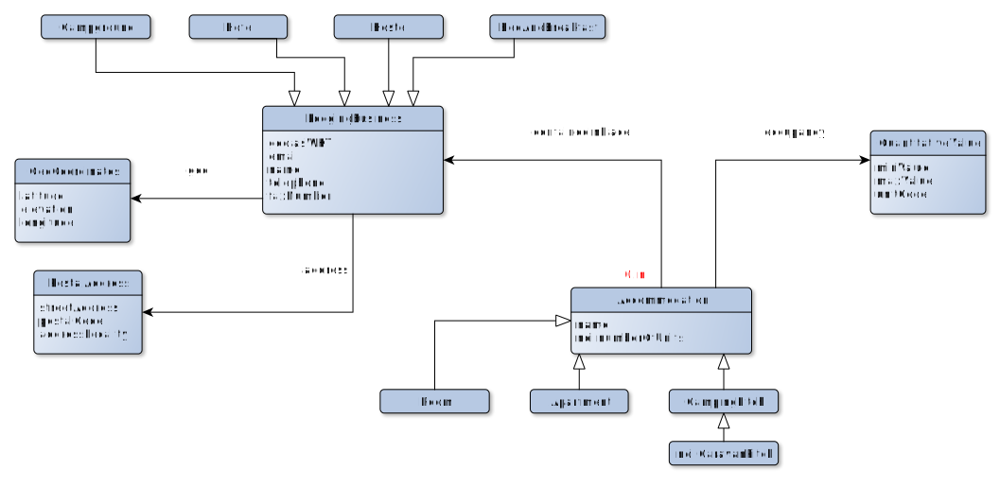
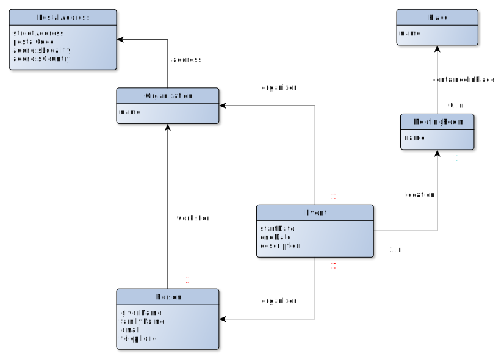

# Schema of the ODH VKG

The Open Data Hub Virtual Knowledge Graph is available as a SPARQL endpoint.
Here we describe its schema (its structure).

## How to read the diagrams

### Default prefix
By default, classes and properties use `http://schema.org/` as prefix.

NB: you can dereference the URLs of classes and properties to see their official documentation. For instance, have a look at [http://schema.org/Hotel](http://schema.org/Hotel).

### Arrows

Black arrows are for object properties. White arrows denotes a sub-class relationship.

### Cardinalities
Cardinalities are provided by data and object properties. Cardinalities of 1 are kept most of the time implicit, expect for highlighting something counter-intuitive.

Cardinalities of object properties follow the ["look across" notation](https://www.quora.com/How-do-we-read-cardinality-in-a-UML-diagram-or-in-E-A-diagram) like in UML diagrams. 

For instance, in the accommodation diagram, for each `Accommodation` instance, there is exactly one `LodgingBusiness` instance accessible through the object property `schema:containedInPlace`. On the opposite direction, for each `LodgingBusiness` instance there are 0 or n instances of `Accommodation` that points to it through the object property `schema:containedInPlace`.

## Accommodation

## Food establishments

## Events
